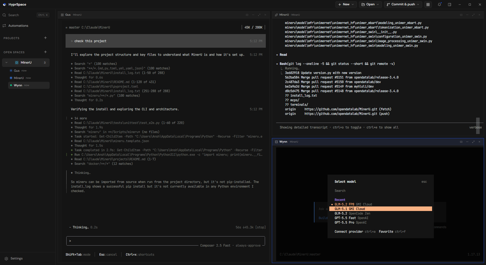

# HyprSpace

A multi-terminal AI workspace. Tile a bunch of Claude Code / Gemini / Codex / shell sessions side by
side and drive them all from one window. Built with Tauri 2 and React.



Work is organised into **projects** (a folder) and **open spaces** (a scratch space whose panes can
each sit in a different folder). Every pane is a real PTY running a real agent CLI, so anything you'd
normally do in a terminal still works.

- **Multi-agent launcher.** Fan out N agents across a folder in one shot, tiled automatically.
- **Per-pane resume**, drag-to-swap panes, and a command palette.
- **Loops.** Scheduled, interval, until-done or manual agents, with mandatory stop limits and
  optional git-worktree isolation.
- **Git review dock** plus an integrated CodeMirror editor for reviewing and fixing what the agents
  did.
- **Startup services** per folder, themes, and auto-update.

It runs agents on *your* CLIs and *your* logins. HyprSpace spawns the `claude` / `gemini` / `codex`
binary you already have installed and authenticated, and never touches your subscription
credentials.

## Prerequisites

- **Rust**, stable toolchain, via [rustup](https://rustup.rs).
- **Node 18+** (20 or 22 recommended) and npm.
- **Windows:** the MSVC C++ build tools ("Desktop development with C++" in the Visual Studio Build
  Tools), plus the WebView2 runtime. WebView2 already ships with Windows 11 and current Windows 10;
  otherwise grab the evergreen installer from Microsoft.
- **macOS:** `xcode-select --install`. See [docs/BUILD-MAC.md](./docs/BUILD-MAC.md) for producing a `.dmg`.
- **Linux:** the standard Tauri deps (`webkit2gtk-4.1`, `libsoup-3.0`, `librsvg2`, `build-essential`).
  Linux mostly works but isn't shipped.

To launch agents you'll also want at least one agent CLI installed and logged in (`claude`, `gemini`,
or `codex`). Panes running a plain shell work without any of them.

## Quick start

```bash
git clone https://github.com/xxashxx-svg/hyprspace.git
cd hyprspace
npm install
npm run tauri dev
```

First run compiles the Rust side, so give it a few minutes. After that TS changes hot-reload, and
Rust changes trigger a recompile and relaunch.

Sign-in is optional. If you want it, copy `.env.example` to `.env` and fill in `VITE_SUPABASE_URL`
and `VITE_SUPABASE_ANON_KEY` from your own Supabase project. Leave them blank and the app skips the
sign-in gate entirely, which is usually what you want locally.

Production build:

```bash
npm run tauri build       # Windows NSIS installer by default
```

## Architecture

The short version: panes are PTYs managed by Rust (`src-tauri/src/pty.rs`), the launch command gets
typed into the shell as keystrokes rather than passed as argv, state lives in Zustand stores and is
persisted by `src-tauri/src/persist.rs`, and the frontend never calls Tauri `invoke()` directly but
goes through `src/api/index.ts`.

- **[CLAUDE.md](./CLAUDE.md)** is the project guide: repo map, hard constraints, architecture
  overview. Read it before writing code. It's written for humans and AI agents alike.
- **[docs/](./docs/README.md)** goes deeper on the subsystems, versioning, and the security audit.

## Contributing

Issues and PRs welcome. [CONTRIBUTING.md](./CONTRIBUTING.md) covers the dev workflow, the style rules
that actually matter, and how to open a PR. Please also read the
[Code of Conduct](./CODE_OF_CONDUCT.md).

Found a security issue? Don't open an issue. See [SECURITY.md](./SECURITY.md).

## License

MIT. See [LICENSE](./LICENSE).

---

### Releasing (maintainers)

Releases are cut with maintainer-local tooling that bumps the version files, builds and signs the
installer, and publishes it with an update manifest. It needs the project's signing keys, so it's
maintainer-only. Bump levels: [docs/VERSIONING.md](./docs/VERSIONING.md).
