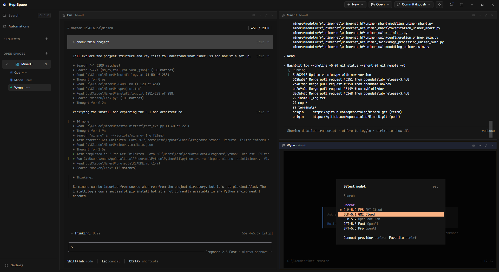

# HyprSpace

A native desktop workspace for coding agents. Run Claude Code, Codex, Gemini and plain shells side
by side in one window. Written in Rust on [GPUI](https://github.com/zed-industries/zed), Zed's GPU
UI framework.



Each folder you work in is a **space** in the sidebar, and each conversation in it is a
**thread**. A thread runs one of two ways:

- **Structured session.** Claude or Codex is driven over its own machine protocol and drawn as a
  transcript: streaming replies, tool calls, diffs, and approval prompts you answer in place. You
  can steer a run while it works, interrupt it, and pick it back up after a restart.
- **Terminal session.** A real PTY running your shell, or an agent CLI interactively, so anything
  you'd do in a terminal still works. Claude's hooks keep the sidebar's status live.

Threads tile in a grid of panes you can resize, swap and maximize. A dock shows the folder's file
tree and a git tab (stage, commit, push, diffs), a viewer shows files with highlighting, and a
usage meter shows your Claude and Codex limits. A command palette (Ctrl+K, or Cmd+K on a Mac)
reaches the rest.

It runs agents on *your* CLIs and *your* logins. HyprSpace spawns the `claude` / `codex` /
`gemini` binary you already have installed and authenticated, and never touches your subscription
credentials.

## Install

```sh
curl -fsSL https://hyprspace.dev/install.sh | sh     # macOS
```

```powershell
irm https://hyprspace.dev/install.ps1 | iex          # Windows
```

macOS gets the app in `/Applications`, Windows runs the signed per-user installer (no admin prompt). Both scripts are
plain text: [read install.sh](https://hyprspace.dev/install.sh) before you pipe it anywhere. If
you'd rather click a button, the [releases page](https://github.com/xxashxx-svg/hyprspace/releases)
has the `.exe` and `.dmg`. HyprSpace ships for Windows and macOS on Apple silicon; Linux builds
stopped in October 2026. An installed copy updates itself.

Everything below is for building it from source.

## Prerequisites

- **Rust 1.98.1** via [rustup](https://rustup.rs) (`rustup toolchain install 1.98.1`), the
  toolchain CI uses.
- **Windows:** the MSVC C++ build tools ("Desktop development with C++" in the Visual Studio Build
  Tools). [NSIS 3](https://nsis.sourceforge.io) only if you build the installer.
- **macOS:** Xcode, plus its Metal toolchain (`xcodebuild -downloadComponent MetalToolchain`), since
  GPUI compiles its shaders at build time. See [docs/BUILD-MAC.md](./docs/BUILD-MAC.md).

To launch agents you'll also want at least one agent CLI installed and logged in (`claude`,
`codex` or `gemini`). Terminal sessions running a plain shell work without any of them.

## Quick start

```bash
git clone https://github.com/xxashxx-svg/hyprspace.git
cd hyprspace
cargo run -p hyprspace
```

The first build compiles GPUI and the rest of the dependency tree, so give it a few minutes.
`cargo run -p hyprspace -- <folder>` opens straight into that folder.

A dev build keeps its state in `~/.hyprspace/native`, the same place an installed copy does. Set
`HYPRSPACE_STATE_DIR` to another folder to keep the two apart.

Release build and installers:

```bash
cargo build --release -p hyprspace    # target/release/hyprspace(.exe)
./scripts/package-windows.ps1         # Windows: target/package/HyprSpace_<version>_x64-setup.exe
bash scripts/package-macos.sh         # macOS: target/package/HyprSpace.app and a .dmg
```

## Architecture

The short version: a Cargo workspace where the engine (sessions, PTYs, git, usage, persistence)
never depends on the UI, and the GPUI app reaches it only through a typed channel of commands and
events. Structured sessions run through one adapter per CLI (`crates/harness`); terminal sessions
are PTYs whose launch command is typed into the shell, never built from user text.

- **[CLAUDE.md](./CLAUDE.md)** is the project guide: repo map, hard constraints, architecture
  overview. Read it before writing code. It's written for humans and AI agents alike.
- **[docs/](./docs/README.md)** goes deeper on the subsystems, the decisions behind them, and
  versioning.

## Contributing

Issues and PRs welcome. [CONTRIBUTING.md](./CONTRIBUTING.md) covers the dev workflow, the style rules
that actually matter, and how to open a PR. Please also read the
[Code of Conduct](./CODE_OF_CONDUCT.md).

Found a security issue? Don't open an issue. See [SECURITY.md](./SECURITY.md).

## License

MIT. See [LICENSE](./LICENSE). Code adapted from other projects is credited in
[THIRD_PARTY_NOTICES.md](./THIRD_PARTY_NOTICES.md).

The File Explorer icon in the Open menu is by [Icons8](https://icons8.com), used under their free license.

---

### Releasing (maintainers)

`deploy.ps1` bumps the version, writes the changelog, tags, and hands the build to CI, which signs
the installers with the project's updater key held in the repo's secrets. Bump levels:
[docs/VERSIONING.md](./docs/VERSIONING.md).
